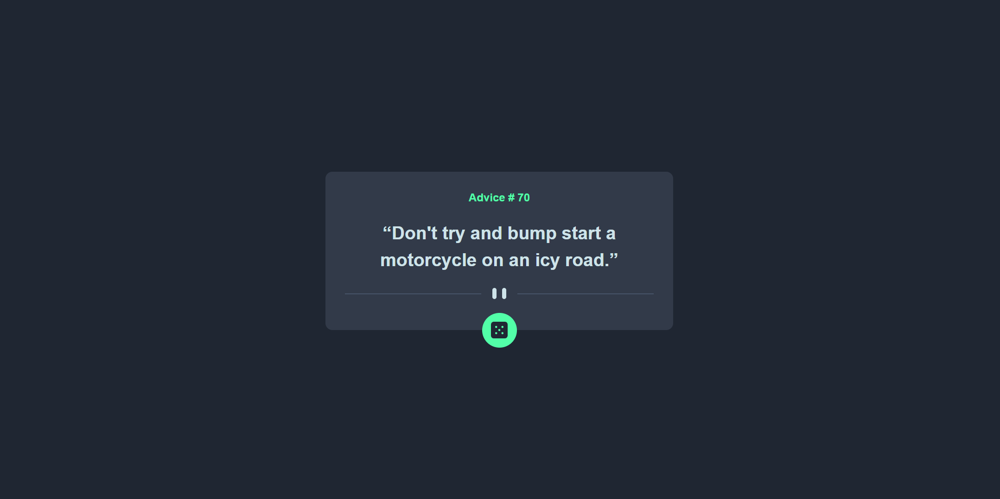

# Frontend Mentor - Advice generator app

This is my personal solution to the [Advice Generator App challenge on Frontend Mentor](https://www.frontendmentor.io/challenges/advice-generator-app-QdUG-13db). 
Frontend Mentor challenges are a fantastic way to hone your coding skills by working on real-world projects. Each challenge provides you with a design mockup at different viewport widths, and your task is to bring that design to life with code.

## Project Overview and Reflections

This was a really fun challenge, where I crafted a minimalist component to display advice fetched from the Advice Slip API. The magic began with a fetch request triggered by an event listener attached to the green button adorned with a dice icon. To ensure a seamless user experience, I incorporated a slick CSS rotation animation for the button, signaling that data is being fetched. This animation kicks in on a click event and gracefully halts when the data arrives or in the event of an error.

For maintaining clean and organized code, I followed a variation of the BEM naming convention, influenced by the wisdom of industry experts like Harry Roberts and Nicolas Gallagher. You can explore one of the articles that delves into this BEM variation [Here](https://csswizardry.com/2013/01/mindbemding-getting-your-head-round-bem-syntax/).

I'm eagerly looking ahead to more advanced challenges on Frontend Mentor, where I can leverage JavaScript to add even more functionality to the designs. Stay tuned for more exciting projects and enhancements!

## Table of contents

  - [Screenshot](#screenshot)
  - [Links](#links)
  - [Built with](#built-with)
  - [Author](#author)

### Screenshot
##### Desktop View - Below (1440px viewport width)

##### Mobile View - Below (375px viewport width)

### Links

- Solution URL: [https://github.com/jacksen30/advice-generator-app]
- Live Site URL: [https://advice-app-jn.netlify.app/]

### Built with

- Semantic HTML5 markup
- JavaScript
- CSS 3 + FLEX layout
- BEM (Nicolas Gallagher Variation) 
- Mobile First Design

## Author

- Website - [Jacksen Nillson](https://devbyjacksen.com/)
- Frontend Mentor - [@jacksen30](https://www.frontendmentor.io/profile/jacksen30)